# CrDB SkillForge

> **Executable CockroachDB expertise for AI agents.**

[](LICENSE)
[](pyproject.toml)
[](package.json)
[](https://www.cockroachlabs.com)
[](docs/aws-integration.md)

**CrDB SkillForge** is a curated, production-quality, open-source collection of **machine-executable Agent Skills** encoding CockroachDB expertise. It is portable across Claude, Cursor, LangChain, AWS Bedrock, AWS Lambda, and any MCP (Model Context Protocol) compatible AI client.

This repository turns static CockroachDB documentation into an interactive, machine-executable intelligence layer that enables AI agents to discover relevant skills, inspect schema and indexes, analyze SQL execution plans, diagnose issues, recommend/apply safe remedies, and verify outcomes against real database instances.

---

## Why Agentic Memory? Why Now?

AI agents are rapidly moving from experiments into real production workflows—writing code, running pipelines, diagnosing incidents, and driving application traffic scale beyond human limits. But here's the problem: **agents need memory that never goes down**.

An agent whose memory goes offline doesn't degrade gracefully, it stops. Traditional databases were optimized for human-scale reads and writes. Agentic systems are different: they spawn autonomously, write constantly, and require memory that persists across regions, failures, and scale (with zero data loss and zero maintenance windows).

**CockroachDB** is built for exactly this. It is the system of record for agentic memory: globally distributed, always-on, PostgreSQL-compatible, and natively integrated into the agent toolchain through MCP, cloud, vector indexing, and an open-source skills ecosystem.

---

## Core Architecture

```mermaid
flowchart LR
    User([User / Agent Query]) --> Discovery[Skill Discovery Engine]
    Discovery --> CanonicalSkills[Canonical Skills Collection]
    CanonicalSkills --> Adapters[Adapter Layer]

    subgraph Adapters
        MCP[MCP Server stdio]
        Cursor[Cursor MDC Generator]
        LangChain[LangChain StructuredTools]
        AWS[AWS Bedrock / Lambda OpenAPI]
    end

    Adapters --> ToolExecution[Tool Execution Layer]

    subgraph ToolExecution
        SQL[sql-execution]
        EXPLAIN[explain-analyze]
        Schema[inspect-schema]
        Indexes[inspect-indexes]
        Cluster[cluster-metadata]
        Vector[vector-search]
        Cloud[ccloud-cli]
    end

    ToolExecution --> CockroachDB[(CockroachDB Memory & DB)]
    CockroachDB --> Telemetry[Telemetry & Diagnostic Audit]
    Telemetry --> S3[(Amazon S3 Storage Archive)]
```



---

## CockroachDB & AWS Tooling Integration

### CockroachDB Tools Used
1. **MCP Server**: Stdio JSON-RPC 2.0 server exposing `skill://` resources and diagnostic tools (`search_skills`, `get_skill`, `execute_sql`, `explain_analyze`, `inspect_schema`, `inspect_indexes`, `cluster_metadata`, `vector_search`).
2. **ccloud CLI**: `ccloud` CLI integration wrapper for managing Cockroach Cloud serverless and dedicated cluster topologies.
3. **Distributed Vector Indexing**: Nearest neighbor vector similarity search (`<->` operator) over CockroachDB vector columns for fast agentic memory retrieval.
4. **Agent Skills**: 21 canonical machine-executable `SKILL.md` definitions with frontmatter metadata, diagnostic workflows, and verification queries.

### AWS Services Used
1. **Amazon Bedrock**: Foundation model reasoning (Claude v2 / Bedrock Agents) over CockroachDB diagnostic telemetry and agentic memory context.
2. **AWS Lambda**: Serverless execution layer hosting Bedrock Action Group handlers (`adapters/aws-lambda/lambda_function.py`).
3. **Amazon S3**: Telemetry and diagnostic audit log archival (`tools/aws/s3.py`).

---

## Initial Skill Collection (21 Canonical Skills)

| Category | Skill Name | Description / Trigger | Risk Level |
|---|---|---|---|
| **Onboarding** | `cluster-setup-local` | Initialize local single-node/multi-node dev cluster | Low |
| | `connect-from-app` | Configure client connection strings & SSL settings | Low |
| | `choosing-a-driver` | Select & configure driver / ORM (psycopg, pgx, pg) | Low |
| **Query & Schema** | `hash-sharded-indexes` | Hash-shard sequential indexes to prevent range hotspots | Medium |
| | `multi-region-table-design` | Regional by Row, Regional by Table & Global table design | Medium |
| | `avoiding-hotspots` | Diagnose and resolve monotonic primary key hotspots | Low |
| | `json-jsonb-modeling` | Inverted GIN indexes and computed columns for JSONB | Low |
| **Operations** | `rolling-upgrades` | Zero-downtime rolling upgrades & version finalization | Medium |
| | `backup-restore` | Automated BACKUP to AWS S3 & Point-in-Time RESTORE | High |
| | `node-decommissioning` | Safely decommission cluster nodes with range transfer | High |
| | `disaster-recovery` | Multi-region failover and cluster recovery procedures | High |
| **Performance** | `explain-analyze-reading` | Read EXPLAIN (ANALYZE, DISTSQL) & detect full scans | Low |
| | `index-recommendations` | Covering secondary indexes & index usage stats audit | Low |
| | `transaction-retry-handling` | Handle 40001 serialization_failure with retry loops | Low |
| | `contention-diagnosis` | Diagnose lock waiting and transaction contention | Low |
| **Security** | `rbac-setup` | Configure least-privilege roles & database users | Medium |
| | `cert-rotation` | Zero-downtime TLS node/client certificate rotation | High |
| | `encryption-at-rest` | Audit & configure CCEE Encryption at Rest with AWS KMS | High |
| **Observability** | `metrics-and-dashboards` | Prometheus scrapers & DB Console health metrics | Low |
| | `slow-query-triage` | Triage slow queries in node_statement_statistics | Low |
| | `log-interpretation` | Interpret OPS, STORAGE, SQL log channels & crash logs | Low |

---

## Compatibility Matrix

| Client / Framework | Support Status | Integration Method |
|---|---|---|
| **MCP Clients (Claude Desktop, etc.)** | Stable | MCP Server stdio (`adapters/mcp-server`) |
| **Cursor IDE** | Stable | Generated Cursor MDC Rules (`adapters/cursor/generate.py`) |
| **LangChain** | Stable | Python `StructuredTool` Package (`adapters/langchain`) |
| **Amazon Bedrock Agents** | Stable | Bedrock Action Group OpenAPI Spec (`adapters/aws-bedrock`) |
| **AWS Lambda** | Stable | Serverless Event Handler (`adapters/aws-lambda`) |

---

## Quickstart & Installation

### 1. Prerequisites
- Python 3.10+
- Node.js 18+
- Git

### 2. Setup Project
```bash
git clone https://github.com/harshit075/crdb-skillforge.git
cd crdb-skillforge
make setup
```

### 3. Start Local CockroachDB (Optional / Dual-Mode Supported)
```bash
make crdb-up
```
*Note: If no live CockroachDB cluster is running, CrDB SkillForge automatically uses its embedded in-memory database engine for seamless testing.*

### 4. Validate All Skills
```bash
make validate
```

### 5. Run Unit & Adapter Test Suites
```bash
make test
```

### 6. Run Evaluation Harness Benchmark
```bash
make eval
```

### 7. Start Model Context Protocol (MCP) Server
```bash
make mcp
```

### 8. Start Interactive Web Application Studio (http://localhost:8080)
```bash
make app
```
Or run directly: `python app/server.py`

### 9. Generate Cursor Rules
```bash
make cursor
```

### 10. Execute End-to-End Performance Diagnosis Demo
```bash
make demo
```

---

## End-to-End Diagnostic Demonstration

Scenario: *"My CockroachDB application query 'SELECT * FROM orders WHERE status = 'pending' ORDER BY created_at DESC' suddenly became slow. Find out why and fix it."*

```text
User Question
      ↓
Skill Discovery Engine -> Selects 'explain-analyze-reading'
      ↓
Load SKILL.md Instructions
      ↓
Inspect Table Schema & Indexes (`inspect_schema`, `inspect_indexes`)
      ↓
Run EXPLAIN (ANALYZE, DISTSQL) -> Identifies Full Table Scan (1,204 rows read)
      ↓
Amazon Bedrock Model Reasoning -> Recommends Covering Secondary Index
      ↓
Apply Safe Index Fix (`execute_sql` with `confirm=True`)
      ↓
Re-run EXPLAIN (ANALYZE, DISTSQL) -> Confirms Covering Index Scan Conversion
      ↓
Archive Telemetry & Audit Result to Amazon S3
```

Run locally:
```bash
python examples/performance-diagnosis/run_demo.py
```

---

## Repository Structure

```text
crdb-skillforge/
├── README.md
├── LICENSE
├── CONTRIBUTING.md
├── CODE_OF_CONDUCT.md
├── GOVERNANCE.md
├── SECURITY.md
├── CHANGELOG.md
├── Makefile
├── pyproject.toml
├── package.json
├── .gitignore
├── .env.example
│
├── skills/
│   ├── onboarding/ (cluster-setup-local, connect-from-app, choosing-a-driver)
│   ├── query-schema-design/ (hash-sharded-indexes, multi-region-table-design, avoiding-hotspots, json-jsonb-modeling)
│   ├── operations/ (rolling-upgrades, backup-restore, node-decommissioning, disaster-recovery)
│   ├── performance/ (explain-analyze-reading, index-recommendations, transaction-retry-handling, contention-diagnosis)
│   ├── security/ (rbac-setup, cert-rotation, encryption-at-rest)
│   └── observability/ (metrics-and-dashboards, slow-query-triage, log-interpretation)
│
├── adapters/
│   ├── mcp-server/ (package.json, index.js, test.js)
│   ├── cursor/ (generate.py)
│   ├── langchain/ (src/tools.py)
│   ├── aws-bedrock/ (generate_openapi.py)
│   └── aws-lambda/ (lambda_function.py)
│
├── tools/
│   ├── validate-skill.py
│   ├── new_skill.py
│   ├── new-skill.sh
│   ├── crdb/ (client.py, sql.py, explain.py, schema.py, indexes.py, cluster.py, vector.py, ccloud.py)
│   ├── aws/ (bedrock.py, s3.py)
│   └── eval-harness/ (run.py, cases.yaml, scoring.py)
│
├── tests/
│   ├── unit/ (test_crdb_tools.py)
│   ├── skills/ (test_skills_validator.py)
│   ├── adapters/ (test_cursor_adapter.py, test_langchain_adapter.py)
│   └── integration/ (test_database_integration.py)
│
├── examples/
│   ├── performance-diagnosis/ (run_demo.py)
│   └── agentic-memory-bedrock/ (run_agentic_memory.py)
│
├── docker/
│   └── cockroach/ (docker-compose.yml)
│
├── .github/
│   ├── workflows/ (validate.yml, tests.yml, eval.yml, nightly.yml)
│   └── ISSUE_TEMPLATE/
│
└── docs/
    ├── architecture.md
    ├── skill-authoring.md
    ├── execution.md
    ├── evaluation.md
    ├── mcp.md
    ├── cursor.md
    ├── langchain.md
    ├── aws-integration.md
    ├── demo-video-script.md
    └── submission-guide.md
```

---

## Security & Safety Model

1. **Default Read-Only Execution**: Diagnostic tools operate read-only by default.
2. **Mutation Controls**: Statements modifying schema or state (DROP, ALTER, DELETE) require explicit confirmation (`read_only=False`, `confirm=True`).
3. **No Credential Leaks**: Connection parameters and query errors are sanitized.

---

## Governance & Staleness Policy

All skills contain a `last_verified` date. Skills unverified for > 6 months are automatically flagged as `STALE` by `tools/validate-skill.py` and reported during nightly CI runs.

---

## License

Licensed under the [Apache-2.0 License](LICENSE).

*CrDB SkillForge is a community-maintained agent skills project and is not official CockroachDB documentation unless explicitly stated otherwise.*
