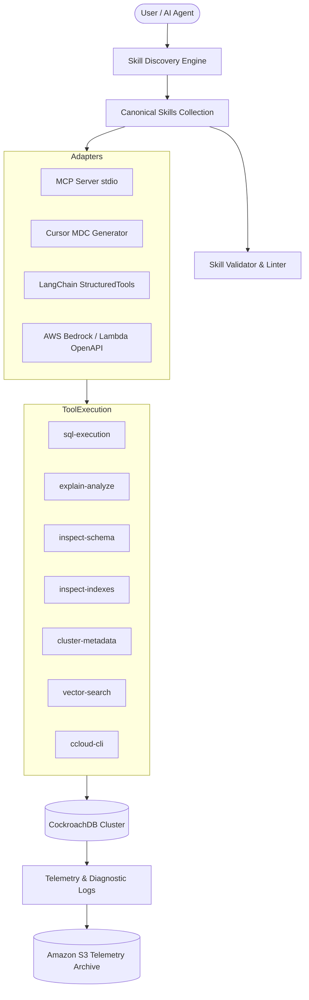

# CrDB SkillForge — System Architecture

**CrDB SkillForge** provides machine-executable CockroachDB expertise for AI agents across Claude, Cursor, LangChain, AWS Bedrock, and MCP clients.

## System Components

1. **Canonical Skills Collection (`skills/`)**: Single source of truth for 21 CockroachDB skills written in structured `SKILL.md` format with YAML frontmatter.
2. **Validator (`tools/validate-skill.py`)**: Enforces frontmatter schema, structural rules, staleness checks (>6 months), and evaluation harness link integrity.
3. **Tool Execution Layer (`tools/crdb/`)**: Reusable Python functions with safe query parameterization, read-only defaults, and explicit mutation controls.
4. **Adapter Layer (`adapters/`)**: Dynamically compiles canonical skills into target framework formats (MCP JSON-RPC, Cursor MDC rules, LangChain tools, and AWS Bedrock Action Groups).
5. **Evaluation Harness (`tools/eval-harness/`)**: Benchmark suite evaluating skill selection accuracy, behavior coverage, and real database verification.
